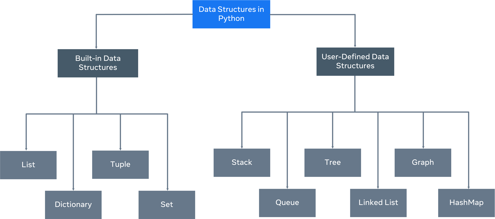

What are data structures?
This reading introduces you to data structures. So far, you have only stored small bits of data in a variable. This was either an integer, Boolean or a string. 

But what happens if you need to work with more complex information, such as a collection of data like a list of people or a list of companies? 

Data structures are designed for this very purpose.

Python has the following built-in data structures: List, dictionary, tuple and set. These are all considered non-primitive data structures, meaning they are classed as objects, this will be explored later in the course. 

Python allows users to create their own. 
- Data structures such as Stacks, Queues and Trees can all be created by the user. 

Mutability 
- refers to data inside the data structure that can be modified.
- change, update, or delete the data
- A list is an example of a mutable data structure.

immutable data structure 
- will not allow modification once the data has been set. 
- The tuple is an example of an immutable data structure.
